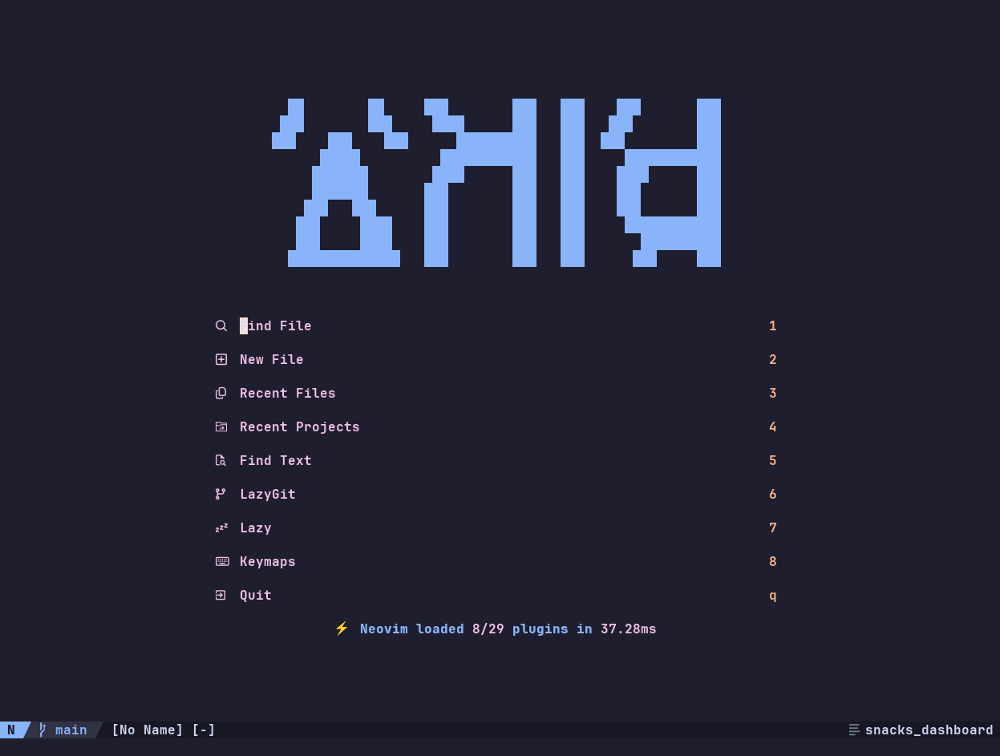

# nvim-simple-config

A simple and minimal Neovim configuration designed for developers who want a lightweight yet powerful editing experience out of the box.

## Features

- **Lightweight and fast** - Minimal overhead for smooth performance
- **Pre-configured plugins** - Essential plugins included and ready to use
- **LSP support** - Built-in Language Server Protocol integration for intelligent code completion
- **Diagnostics** - Real-time error, warning, and info notifications with easy navigation
- **Optimized key mappings** - Carefully chosen shortcuts for efficient editing workflows
- **Git integration** - Visual git signs and Lazygit support for version control
- **File explorer** - Neo-tree file navigation for quick project browsing
- **Auto-completion** - Smart completion engine with LSP, buffer, path, and snippet sources
